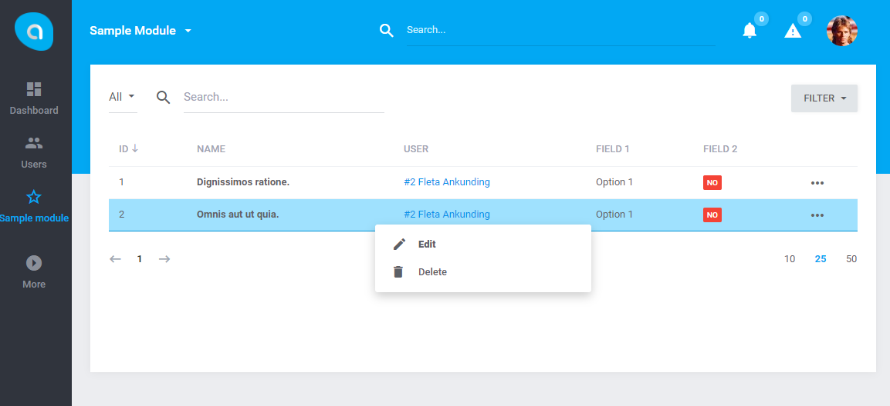

# Antares Sample Module

Antares Sample Module is an example module which can be treated as very first place to start working with Antares. It includes many of samples such as:

- events
- processors
- ui components
- ui templates
- forms
- views
- notifications
- migrations
- filters

and much more. It provides sources of [tutorial](http://antaresproject.io/docs/site/tutorials/sample_module/index.html).

## Documentation

Antares Sample Module documentation can be found at [antaresproject.io/docs/site/tutorials/sample_module](http://antaresproject.io/docs/site/tutorials/sample_module/index.html).

Full Antares documentation can be found at [antaresproject.io/docs](http://antaresproject.io/docs).

## Changelog

Antares Application Skeleton changelog can be found in release notes [antaresproject.io/docs/site/getting_started/changelog#sample_module](http://antaresproject.io/docs/site/getting_started/changelog/index.html#sample_module).

You can find full Antares changelog in Antares Documentation [antaresproject.io/docs/site/getting_started/changelog](http://antaresproject.io/docs/site/getting_started/changelog/index.html).

## Issues

The issue list of this repo is **exclusively** for bug reports and feature requests.

Please follow [Issue Reporting Guide](http://antaresproject.io/docs/site/getting_started/issues_reporting_guide/index.html) before opening an issue. Issues not following the guide will be closed without further investigation.

## Contribution

Please follow [Contribution Guide](http://antaresproject.io/docs/site/getting_started/contributing/index.html) before making a pull request.

## Community

* Twitter: @antaresproject
* Forum: (coming soon)
* Blog: (coming soon)
* Email: contact (at) antaresproject.io

## License

This software is released under the BSD 3-Clause License.

© 2017 INBS.Software.

